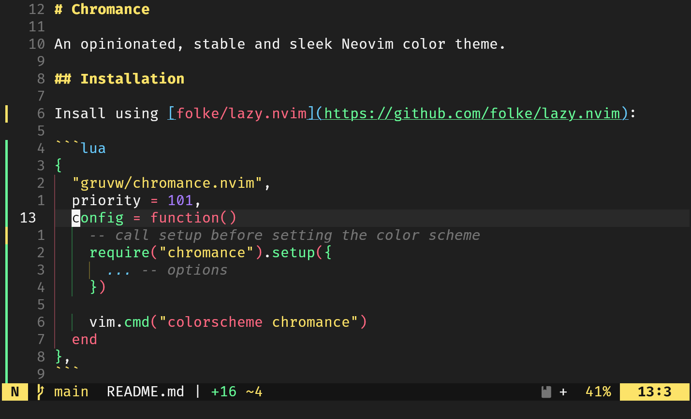

# Chromance

An opinionated, stable and sleek Neovim color theme.



## Installation

GitHub handle: `https://github.com/gruvw/chromance.nvim`

Install using [folke/lazy.nvim](https://github.com/folke/lazy.nvim):

```lua
{
  "gruvw/chromance.nvim",
  priority = 101,
  config = function()
    -- call setup before setting the color scheme
    require("chromance").setup({
      ... -- options
    })
  
    vim.cmd("colorscheme chromance")
  end
},
```

**Note**: You have to call `require("chromance").setup()` before setting your colors scheme to `chromance`.

### Information

- Default **options** (plugin config): [config.lua](./lua/chromance/config.lua) (see `default_options`)
- List of **supported plugins**: [groups/plugins/](./lua/chromance/groups/plugins)

## Contributing

Feel free to contribute by submitting pull requests, whether to add support for other plugins, improve existing functionality, or fix bugs :)

Before opening a new PR, please open an issue to discuss it beforehand (and check for existing issues first).

**Note** - Initially inspired by [loctvl842/monokai-pro.nvim](https://github.com/loctvl842/monokai-pro.nvim) Spectrum variant (project forked at [872f774](https://github.com/loctvl842/monokai-pro.nvim/commit/872f774303f79416000e8049630052f4124d9534), largely deviated).
